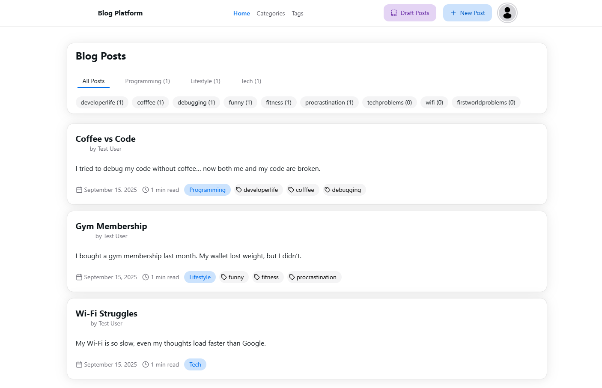

# 📖 Blog Application (Spring Boot)

This project is a **Blog Application** built with **Spring Boot**.  
Users can **authenticate via JWT**, create, update, and delete blog posts under specific **categories** and **tags**.  

---

## 🚀 Features
- 🔐 **Authentication & Authorization**
  - JWT-based authentication
  - Login endpoint
  - Draft posts accessible only for authenticated users

- 📝 **Blog Management**
  - Create, update, delete blog posts
  - `DRAFT` / `PUBLISHED` status support
  - Automatic reading time calculation

- 📂 **Category Management**
  - Create, list, and delete categories
  - Prevent deletion if posts are associated

- 🏷 **Tag Management**
  - Create multiple tags at once
  - Reuse existing tags
  - Prevent deletion if tags are associated with posts

- ⚙️ **Tech Stack**
  - **Spring Boot 3**
  - **Spring Security** + JWT
  - **Spring Data JPA** (Hibernate)
  - **PostgreSQL** (dev/prod) & **H2** (test)
  - **MapStruct** (Entity ↔ DTO mapping)
  - **Lombok**
  - **Maven**
  - **Docker** (optional for DB containerization)
  - **Validation (Jakarta Bean Validation)**

---

## 📸 Screenshots

⚡ The following screenshots are taken using a **ready-made frontend** connected to this backend API.

<p align="center">
  
</p>

---

## 🏗 Project Structure
```
src/main/java/com/doruk/blog
 ┣ domain/        → Entities, DTOs, Request/Response models
 ┣ repositories/  → JPA Repositories
 ┣ services/      → Business logic (Service & Impl)
 ┣ mappers/       → MapStruct mappers
 ┣ security/      → JWT, UserDetails, Filter
 ┣ controllers/   → REST API controllers
```

---

## ⚡ API Examples

### Auth
```http
POST /api/v1/auth/login
Content-Type: application/json

{
  "email": "user@test.com",
  "password": "password"
}
```

### Post
```http
POST /api/v1/posts
Authorization: Bearer <token>
Content-Type: application/json

{
  "title": "New Blog Post",
  "content": "Lorem ipsum...",
  "categoryId": "UUID",
  "tagIds": ["UUID", "UUID"],
  "status": "PUBLISHED"
}
```

---

## 🛠 Setup & Run

### 1. Clone the Repository
```bash
git clone https://github.com/<dorukmenguverdi>/springboot-blog-app.git
cd springboot-blog-app
```

### 2. Configuration
Set your database and JWT configuration inside

spring.application.name=blog

jwt.secret=your-256-bit-secret-key-here-make-it-at-least-32-bytes-long

# Database Connection
spring.datasource.url=jdbc:postgresql://localhost:5432/postgres
spring.datasource.username=username
spring.datasource.password=fullsecretpassword

@ JPA Configuration
spring.jpa.hibernate.ddl-auto=update
spring.jpa.show-sql=true
spring.jpa.properties.hibernate.format_sql=true
spring.jpa.properties.hibernate.dialect=org.hibernate.dialect.PostgreSQLDialect

### 3. Run PostgreSQL with Docker
```bash
docker run --name blog-postgres -e POSTGRES_PASSWORD=meyfullsecretpassword -p 5432:5432 -d postgres
```

### 4. Run the Application
```bash
mvn spring-boot:run
```

By default, the app runs at [http://localhost:8080](http://localhost:8080).

---

## ✅ Testing
- **Unit Tests** run automatically on an H2 in-memory database.
```bash
mvn test
```

---

## 📄 License
This project was developed for **personal learning and portfolio purposes**.  
